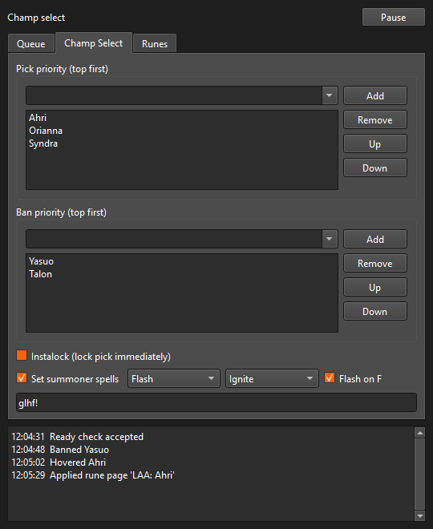
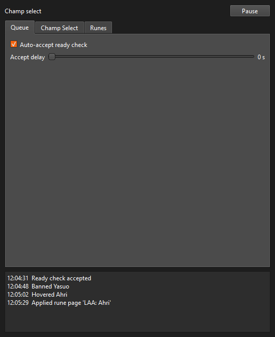
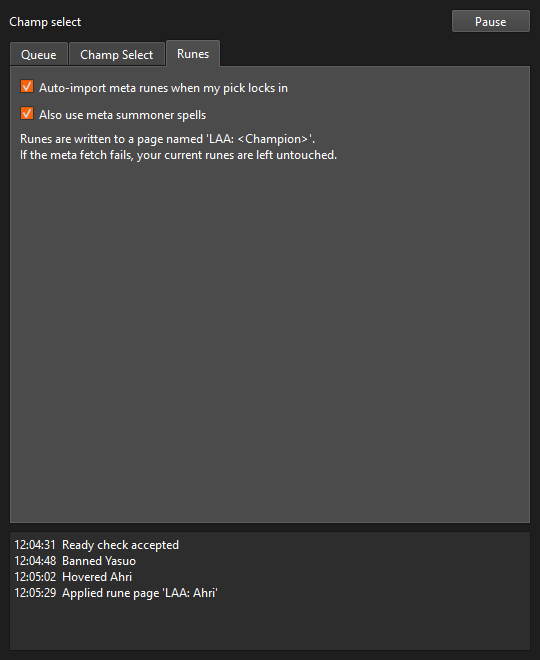

<p align="center">
  
</p>

<h1 align="center">League Auto Accept</h1>

<p align="center">
  <a href="https://github.com/moleicafe/lol-auto-accept/actions/workflows/ci.yml"></a>
</p>

**A Windows desktop app that plays the boring parts of League of Legends matchmaking for you — auto-accepting queues, locking your champion, and importing the current meta rune page the moment you lock in.**

Built for League players who queue up and step away: it accepts the ready check so you never miss a game, declares your pick and bans from a priority list, and — the headline feature — pulls the current meta runes and summoner spells for your champion and role from op.gg and writes them to a dedicated rune page automatically. It's a ground-up Python rebuild of the C# [sweetriverfish/LeagueAutoAccept](https://github.com/sweetriverfish/LeagueAutoAccept), reimagined with a proper GUI, a system-tray background mode, and automatic rune importing that the original didn't have.

It talks only to Riot's **local** League Client (LCU) API on your own machine — the same interface the client's own UI uses — plus op.gg for public build data. No Riot API key, no account credentials, nothing leaves your PC except an anonymous stats lookup.

> **Status:** ✅ Complete and working — 65 automated tests, packaged as a standalone `.exe`. The op.gg build data source is verified live.

## Screenshots

| Champ Select | Queue | Runes |
| :---: | :---: | :---: |
|  |  |  |

*Pick/ban priority lists with champion autocomplete, a live activity log, and the auto-rune settings. Closing the window drops it to the system tray so it keeps working in the background.*

## Features

- **Never miss a queue** — auto-accepts the ready check, with an optional 0–10s delay if you like a moment to react.
- **Pick & ban from priority lists** — declares the first available champion from your ordered list, falling back down the list if one is banned or taken. Optional instalock.
- **Summoner spells** — sets your two spells with a Flash-on-D / Flash-on-F preference.
- **Auto meta runes (the headline feature)** — when your pick locks in, it fetches the current meta rune page *and* summoner spells for that champion and assigned role from op.gg, and writes them to a rune page named `LAA: <Champion>`. Your own pages are never touched, and if the lookup fails your current runes are left exactly as they were — it never blocks your pick.
- **One-time lobby message** — posts a configurable "glhf!" to champ-select chat.
- **Runs in the background** — minimizes to the system tray with a master pause you can hit from the tray or the window, kept in sync both ways.
- **Everything is individually toggleable** — turn off any single automation without affecting the rest.

## How it works

```
LeagueClientUx.exe ──▶ LCUConnector ──▶  Engine  ──▶  PySide6 GUI
 (local LCU API)      (asyncio: process   (Qt-free      (+ system tray)
                       discovery, HTTPS,   state machine
                       websocket events)   per game phase)
```

A background thread discovers the running League client (reading its port and auth
token from the process command line), connects to the local LCU over HTTPS + a
websocket, and streams typed game-phase events into a pure-logic **engine**. The
engine drives the automations and, on lock-in, calls the op.gg rune provider. The
**PySide6** GUI runs on the main thread and communicates with the worker purely
through thread-safe Qt signals and an atomically-swapped config snapshot. The core,
LCU, and rune layers are deliberately Qt-free and unit-tested in isolation.

## Tech stack

- **Python 3.12**, **asyncio** for the LCU connector and event loop
- **PySide6 (Qt 6)** for the GUI and system tray
- **httpx** (async HTTP) + **websockets** for the local LCU API
- **psutil** for League client process discovery
- **pytest** / **pytest-qt** / **aiohttp** test server — 65 tests
- **PyInstaller** for the single-file `.exe`

## Getting started

**Prerequisites:** Windows, Python 3.12+, and the League of Legends client installed.

**Run from source:**

```powershell
python -m venv .venv
.venv\Scripts\python -m pip install -e .
.venv\Scripts\python -m laa
```

Launch the League client, open the app, configure your picks/bans and toggles, and
queue up. Settings and logs are stored in `%APPDATA%\LeagueAutoAccept\`.

**Build the standalone executable:**

```powershell
.venv\Scripts\python -m pip install -e ".[dev]"
.\build.ps1        # produces dist\LeagueAutoAccept.exe
```

**Run the tests:**

```powershell
.venv\Scripts\python -m pytest -q
```

## Disclaimer

League Auto Accept isn't endorsed by Riot Games and doesn't reflect the views or
opinions of Riot Games or anyone officially involved in producing or managing League
of Legends. LCU automation of this kind is tolerated on most servers but violates
Korean server policy — use at your own risk.

## License

[MIT](LICENSE) © 2026 Ye Molei. Inspired by the original
[sweetriverfish/LeagueAutoAccept](https://github.com/sweetriverfish/LeagueAutoAccept) (also MIT).
